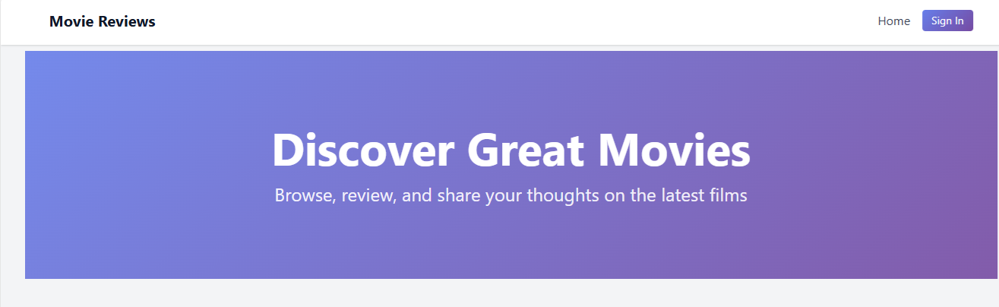

# Movie Review Website

A modern movie review platform built with Next.js, TypeScript, and Tailwind CSS, featuring glassmorphism design, smooth animations, and comprehensive movie cataloging.

## � Preview



*Beautiful glassmorphism design with 80+ movies ready to browse*

---

## �🚀 Quick Start (No Firebase Required!)

Get up and running in under 5 minutes with **mock data mode**:

```bash
# Clone the repository
git clone https://github.com/travisdazell/movie-review-website.git
cd movie-review-website

# Install dependencies
npm install

# Start development server
npm run dev
```

Navigate to [http://localhost:3000](http://localhost:3000) - the app automatically loads with 80 movies and 500+ reviews!

**✨ No configuration needed** - Firebase credentials are optional for local development.

---

## 📦 Features

### Core Functionality
- **Movie Catalog**: Browse 80+ movies with posters, metadata, and reviews
- **Movie Details**: View comprehensive information, cast, and user reviews
- **Review System**: Read reviews with letter grades (A+ through F)
- **Responsive Design**: Beautiful UI optimized for all screen sizes

### Modern UI/UX
- **Glassmorphism Effects**: Frosted glass design with backdrop blur
- **3D Animations**: Interactive tilt effects and hover states
- **Smooth Transitions**: Framer Motion animations throughout
- **Gradient Backgrounds**: Vibrant, animated color schemes
- **Skeleton Loaders**: Polished loading states for better UX

---

## 🎬 Mock Data Mode

### How It Works

The app **automatically detects** when Firebase is not configured and serves mock data instead:

- ✅ **No .env.local file** → Mock data activated
- ✅ **80 movies** from classics to modern releases
- ✅ **500+ reviews** with realistic content and varied grades
- ✅ **Instant startup** - no database connection required

### When You'll See Mock Data

Console output when running in mock mode:

```
🎬 Development mode: Using mock movie data
📊 Loaded 80 movies and 487 reviews from lib/data/mock-movies.json
```

### Switching to Firebase (Optional)

To use Firebase Firestore instead of mock data:

1. Create `.env.local` in the project root:

```env
FIREBASE_PROJECT_ID=your-project-id
NEXT_PUBLIC_FIREBASE_API_KEY=your-api-key
NEXT_PUBLIC_FIREBASE_AUTH_DOMAIN=your-project.firebaseapp.com
NEXT_PUBLIC_FIREBASE_STORAGE_BUCKET=your-project.appspot.com
NEXT_PUBLIC_FIREBASE_MESSAGING_SENDER_ID=123456789
NEXT_PUBLIC_FIREBASE_APP_ID=1:123456789:web:abcdef
```

2. Restart the development server:

```bash
npm run dev
```

Console will now show:
```
✅ Connected to Firebase Firestore
```

---

## 🛠️ Technology Stack

### Frontend
- **Framework**: Next.js 14.2.35 (React 18)
- **Language**: TypeScript 5.x
- **Styling**: Tailwind CSS v4 with custom gradients and animations
- **Animation**: Framer Motion 10.0.0

### Backend (Optional - Firebase)
- **Database**: Firebase Firestore (optional in development)
- **Authentication**: NextAuth.js with Google OAuth
- **API**: Next.js API Routes

### Development
- **Mock Data**: JSON-based static dataset (80 movies, 500+ reviews)
- **Image Service**: picsum.photos placeholders
- **Environment Detection**: Automatic Firebase vs. mock mode switching

---

## 📂 Project Structure

```
movie-review-website/
├── components/          # React components
│   ├── Button.tsx       # Reusable button with loading states
│   ├── MovieCard.tsx    # Movie card with 3D tilt effect
│   ├── ReviewForm.tsx   # Review submission form
│   ├── ReviewList.tsx   # Review display with grade badges
│   ├── Navigation.tsx   # Animated navigation bar
│   └── ...
├── lib/
│   ├── data/
│   │   └── mock-movies.json        # 80 movies + 500+ reviews
│   ├── hooks/                      # Custom React hooks
│   │   ├── use3DTilt.ts            # 3D tilt animation
│   │   ├── useParallax.ts          # Parallax scrolling
│   │   └── useScrollAnimation.ts   # Scroll-triggered animations
│   ├── mock-data-loader.ts         # Mock data logic
│   ├── db.ts                       # Firebase database utilities
│   ├── auth.ts                     # Authentication helpers
│   └── types.ts                    # TypeScript interfaces
├── pages/
│   ├── api/                 # API routes (auto-detect mock vs Firebase)
│   │   ├── movies/
│   │   │   ├── index.ts     # GET all movies
│   │   │   ├── [id].ts      # GET single movie with reviews
│   │   │   └── [id]/
│   │   │       └── reviews.ts  # GET/POST reviews for movie
│   │   └── reviews/
│   │       └── [id].ts      # GET/PUT/DELETE individual review
│   ├── index.tsx            # Homepage
│   ├── movies/
│   │   └── [id].tsx         # Movie detail page
│   └── admin/               # Admin dashboard
├── styles/
│   └── globals.css          # Tailwind v4 configuration
├── specs/                   # Feature specifications
│   ├── 001-movie-review-website/
│   ├── 002-modern-ui-enhancements/
│   └── 003-mock-movie-data/
└── ...
```

---

## 🎨 Customizing Mock Data

### Adding Movies

1. Open `lib/data/mock-movies.json`
2. Add a new movie to the `movies` array:

```json
{
  "id": "mov-081",
  "title": "Your Movie Title",
  "year": 2024,
  "director": "Director Name",
  "actors": ["Actor 1", "Actor 2", "Actor 3"],
  "image": "https://picsum.photos/seed/mov-081/300/450"
}
```

3. Optionally add reviews to the `reviews` object:

```json
"mov-081": [
  {
    "id": "rev-081-001",
    "userId": "your_username",
    "grade": "A",
    "text": "Amazing movie! Highly recommended for fans of the genre.",
    "createdAt": "2026-02-01T10:00:00Z"
  }
]
```

4. Restart dev server - your new movie appears immediately!

### Grade Distribution

Current mock data follows realistic review patterns:
- **A+ / A**: 30% (excellent films)
- **B**: 25% (good films)
- **C**: 20% (average films)
- **D**: 15% (below average)
- **F**: 10% (poor films)

---

## 🧪 Development Workflows

### Recommended Workflow

1. **Start in Mock Mode** (default):
   - Develop UI/UX with instant data feedback
   - Test all components without Firebase setup
   - Perfect for offline work

2. **Switch to Firebase** (when ready):
   - Test database integration
   - Implement authentication flows
   - Prepare for production deployment

### Testing Scenarios

**Empty State Testing**:
```
Navigate to a movie with 0 reviews (e.g., mov-010)
Expected: "No reviews yet" message displays
```

**Pagination/Scrolling**:
```
Navigate to a movie with many reviews (e.g., mov-001 - 5 reviews)
Expected: Scroll to view all reviews
```

**Grade Variety**:
```
Browse multiple movies
Expected: Mix of A+, A, B, C, D, F grades visible
```

---

## 📝 Available Scripts

```bash
# Development server with hot reload
npm run dev

# Production build
npm run build

# Start production server
npm start

# Lint code
npm run lint

# Format code
npm run format
```

---

## 🔧 Environment Variables

### Optional (Mock Mode Works Without These!)

```env
# Firebase Configuration (optional for development)
FIREBASE_PROJECT_ID=your-project-id
NEXT_PUBLIC_FIREBASE_API_KEY=your-api-key
NEXT_PUBLIC_FIREBASE_AUTH_DOMAIN=your-project.firebaseapp.com
NEXT_PUBLIC_FIREBASE_STORAGE_BUCKET=your-project.appspot.com
NEXT_PUBLIC_FIREBASE_MESSAGING_SENDER_ID=123456789
NEXT_PUBLIC_FIREBASE_APP_ID=1:123456789:web:abcdef

# Google OAuth (for authentication)
GOOGLE_CLIENT_ID=your-google-client-id
GOOGLE_CLIENT_SECRET=your-google-client-secret

# Admin Configuration
ADMIN_EMAILS=admin1@example.com,admin2@example.com
```

---

## 🚦 Console Indicators

The app uses emoji indicators for transparency:

| Emoji | Meaning |
|-------|---------|
| 🎬 | Mock mode activated |
| 📊 | Data loaded successfully |
| ⚠️ | Warning (minor issue, e.g., review not persisted in mock mode) |
| ❌ | Error (critical issue) |
| ✅ | Firebase mode activated |

**Example Console Output** (Mock Mode):
```
🎬 Development mode: Using mock movie data
📊 Loaded 80 movies from mock data
🎬 Development mode: Loading movie mov-001 from mock data
📊 Loaded 5 reviews for movie mov-001
⚠️ Review submission in mock mode - not persisted
```

---

## 📖 Documentation

Comprehensive documentation available in the `specs/` directory:

- **[Feature 001](specs/001-movie-review-website/)**: Core application specification
- **[Feature 002](specs/002-modern-ui-enhancements/)**: Modern UI/UX implementation
- **[Feature 003](specs/003-mock-movie-data/)**: Mock data mode guide
  - [Quickstart Guide](specs/003-mock-movie-data/quickstart.md)
  - [Data Model](specs/003-mock-movie-data/data-model.md)
  - [Implementation Plan](specs/003-mock-movie-data/plan.md)

---

## 🤝 Contributing

Contributions are welcome! To add more mock movies:

1. Fork the repository
2. Edit `lib/data/mock-movies.json` following the existing schema
3. Validate JSON syntax (use `npx prettier --check lib/data/mock-movies.json`)
4. Submit a pull request

---

## 📄 License

This project is created for educational purposes.

---

## 🙏 Acknowledgments

- **Placeholder Images**: [picsum.photos](https://picsum.photos/)
- **UI Framework**: [Tailwind CSS](https://tailwindcss.com/)
- **Animation Library**: [Framer Motion](https://www.framer.com/motion/)
- **Framework**: [Next.js](https://nextjs.org/)

---

## 💡 Tips & Tricks

### New Developer Onboarding

**Total Time: < 5 minutes!**

1. Clone repository (1-2 min)
2. `npm install` (2-3 min)
3. `npm run dev` + open browser (< 30 sec)
4. ✨ **80 movies with 500+ reviews instantly available!**

No Firebase setup, no environment variables, no configuration files. Just code.

### Troubleshooting

**Issue**: Blank screen or no movies displayed  
**Solution**: 
1. Check browser console for errors
2. Verify mock data JSON is valid: `npx prettier --check lib/data/mock-movies.json`
3. Restart dev server

**Issue**: Images not loading  
**Solution**: picsum.photos may be slow - images will eventually load, or check your internet connection

**Issue**: Console shows Firebase errors  
**Solution**: 
- **Option A**: Remove `.env.local` completely (use full mock mode)
- **Option B**: Complete all Firebase environment variables

For more troubleshooting, see [Quickstart Guide](specs/003-mock-movie-data/quickstart.md#troubleshooting).

---

**Happy Coding! 🎬🍿**
